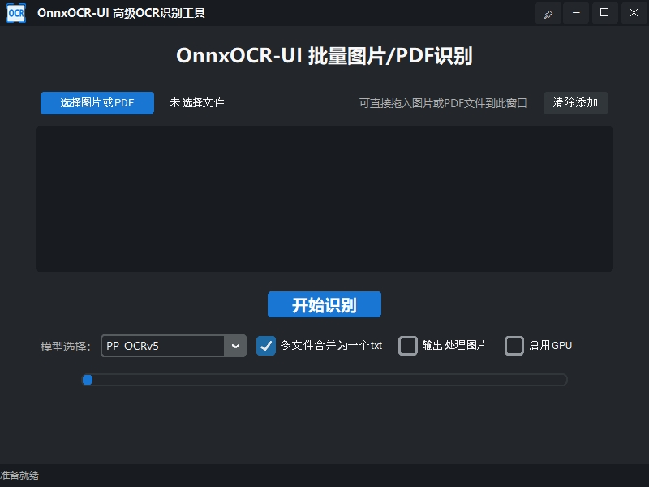

# 🚀 OnnxOCR-UI

## 📖 OnnxOCR-UI 简介
OnnxOCR-UI 是基于 [OnnxOCR](https://github.com/jingsongliujing/OnnxOCR) 的高级批量图片/PDF OCR 识别工具，采用 Tkinter + customTkinter 打造，专为高效、易用和美观的桌面批量文字识别场景设计。



介绍文章：[基于OnnxOCR实现的批量PDF、图片OCR识别工具](https://mp.weixin.qq.com/s/vy1-I9IgwI0Q88n20P9ebw)

## ✨ 主要功能
- 支持批量图片、PDF 文件拖拽或选择添加
- PDF 转图片采用 pymupdf，无需 poppler
- 识别结果可分别输出 txt 或合并为一个 txt，文件名自动带时间戳
- 输出文件夹自动创建，兼容中文路径
- 自定义高端黑色主题 UI，窗口支持拉伸、最大化、最小化、居中、任务栏图标
- 状态栏实时显示进度与提示
- 文件列表区显示文件名、大小、处理用时
- “清除添加”按钮可一键清空已选文件
- 支持模型选择（PP-OCRv5、PP-OCRv4、ch_ppocr_server_v2.0），可热切换
- 可选是否输出处理图片(_ocr.jpg)
- 进度条实时显示整体进度，PDF按页数动态更新
- 多图识别时状态栏提示平均速度

## 🛠️ 依赖环境
- Python 3.7
- customtkinter
- tkinterdnd2
- Pillow
- opencv-python
- pymupdf

安装依赖：
```
pip install -r requirements.txt
```

## 启动方式

```bash
python main.py
```

## 目录结构
- `onnxocr_ui`   项目目录   
    - `ui.py`        UI 界面与交互逻辑
    - `logic.py`     OCR 识别与文件处理逻辑
    - `requirements.txt`  依赖包列表
    - `app_icon.ico` 界面与任务栏图标
- `main.py`      启动入口，仅负责启动 UI

## OCR API (base64 图像识别接口)

### 接口地址

```
POST /ocr_api
```

### 请求格式
Content-Type: application/json

```json
{
  "image": "<图片的base64字符串>"
}
```

### 返回格式

```json
{
  "processing_time": 0.123,
  "results": [
    {
      "text": "识别文本",
      "confidence": 0.99,
      "bounding_box": [[x1, y1], [x2, y2], [x3, y3], [x4, y4]]
    },
    ...
  ]
}
```

### Python 示例代码

```python
import requests, base64

with open('test_images/1.jpg', 'rb') as f:
    img_b64 = base64.b64encode(f.read()).decode()

resp = requests.post('http://127.0.0.1:8000/ocr_api', json={"image": img_b64})
print(resp.json())
```

- 端口号请根据实际 uvicorn 启动参数调整。
- 返回结果为每一行文本的内容、置信度和文本框坐标。

## 其他说明
- 支持 PyInstaller 打包，图标自动适配
- 详细开发说明见 docs/OnnxOCR 开发说明.md
- 版本更新详见 docs/ChangeLogs.md

## 🙏感谢
- [OnnxOCR](https://github.com/jingsongliujing/OnnxOCR)
