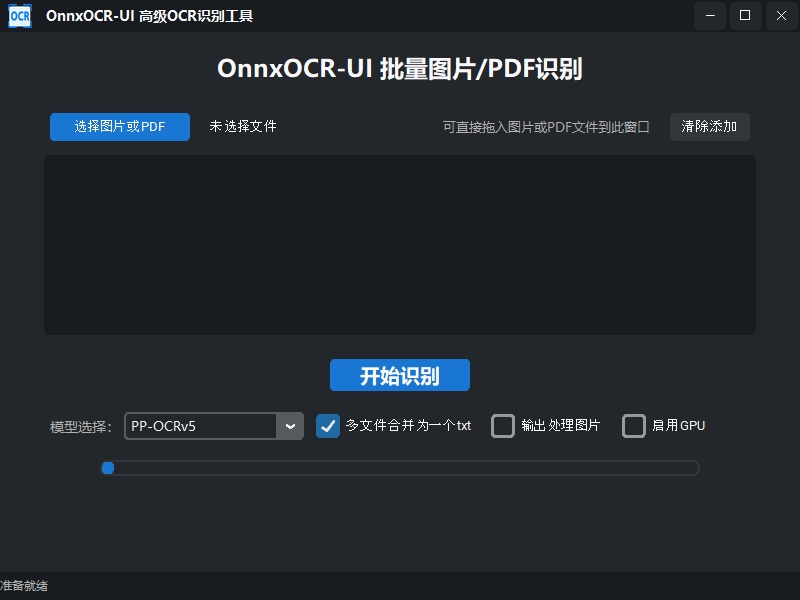

# OnnxOCR-UI 开发说明


## TODO

20250617：有个想法，是不是可以给项目文件夹放一个uv文件，然后通过bat文件自动调用uv创建python环境并安装依赖，一个脚本搞定项目环境安装，待尝试验证。

## OnnxOCR-UI 简介

OnnxOCR-UI 是基于 [OnnxOCR](https://github.com/jingsongliujing/OnnxOCR) 的高级批量图片/PDF OCR 识别工具，采用 Tkinter + customTkinter 打造，专为高效、易用和美观的桌面批量文字识别场景设计。

- 支持批量图片、PDF 拖拽或选择，自动识别并输出 txt 文件（可合并/分开），文件名自动带时间戳。
- PDF 自动拆分为图片逐页识别，进度条动态显示整体进度。
- 支持多种 PaddleOCR onnx 模型（PP-OCRv5、PP-OCRv4、ch_ppocr_server_v2.0）热切换，兼容中文路径。
- 可选是否输出处理图片(_ocr.jpg)，输出文件夹自动创建。
- 高端黑色主题，窗口支持拉伸、最大化、最小化、居中，任务栏图标自适应。
- 状态栏实时显示进度、单图/多图平均速度、识别完成提示。
- 文件列表区显示文件名、大小、处理用时，“清除添加”按钮一键清空。
- 代码结构清晰，UI与逻辑完全分离，便于维护和二次开发。



## 主要功能亮点
- 拖拽/多选图片和PDF，批量识别
- PDF转图片采用pymupdf，无需poppler
- 识别结果可合并/分开输出txt，文件名带时间戳
- 支持模型热切换，兼容多种PaddleOCR onnx模型
- 可选是否输出处理图片
- 进度条、状态栏、任务栏图标、窗口美化
- 适配PyInstaller打包

## 如何使用项目

### 使用UV
UV可以自动处理依赖关系，非常不错，项目最终使用的cp312。

```bash
# 项目python环境由3.7升级为3.8之后，OCR速度提示了很多。
# 不同python版本，requirements.txt不同，详见docs\requirements。
# 例如，使用Python 3.12 版本时，requirements.txt（opencv-python>=4.7.0、numpy<2.0.0、onnxruntime-gpu取消版本要求）。
uv init OnnxOCR-UI --python 3.8 # 自动安装了3.8.20
cd OnnxOCR-UI
# 从网上clone好项目，这里使用 uv venv .venv --python=3.12
uv venv
.venv\Scripts\activate
uv pip install -r requirements.txt --index-url https://pypi.tuna.tsinghua.edu.cn/simple
uv run main.py

# 如要锁定python版本及对应依赖关系，请使用
pip freeze > requirements.txt
# 可选，生成依赖锁定文件
uv pip compile requirements.txt -o requirements.lock
# 后续用锁文件安装：
uv pip install -r requirements.lock
```


### 使用Micromamba
```bash
# 使用python==3.7
micromamba create -p ./runtime python=3.7
micromamba activate ./runtime
./runtime/python.exe -m pip install -i https://pypi.tuna.tsinghua.edu.cn/simple -r requirements.txt 
./runtime/python.exe -m pip list
./runtime/python.exe -m pip install -i https://pypi.tuna.tsinghua.edu.cn/simple -r onnxocr_ui/requirements.txt 

# 使用示例1：
./runtime/python.exe test_ocr.py  
./runtime/python.exe app-service.py

## 运行UI
./runtime/python.exe onnxocr_ui/main.py
```

## 项目需求
参考app-service.py、onnxocr_ui\logic.py，使用flask,写一个webui.py，使用uv run webui.py，可以打开对应的网页，选择或拖入一个或多个图片或PDF文件，点击按钮开始识别，网页展示识别后的文字，并且可以下载所有压缩后识别的txt文件（每一次执行识别，新建一个时间戳文件夹，生成的txt放到里面）。支持多模型热切换。
uv run webui.py
uv run app-service.py

```bash
uv add fastapi uvicorn jinja2 python-multipart
uv remove fastapi uvicorn jinja2 python-multipart
uv add opencv-python

```